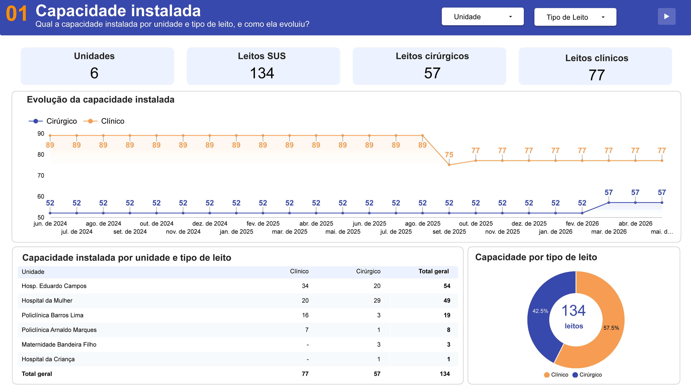
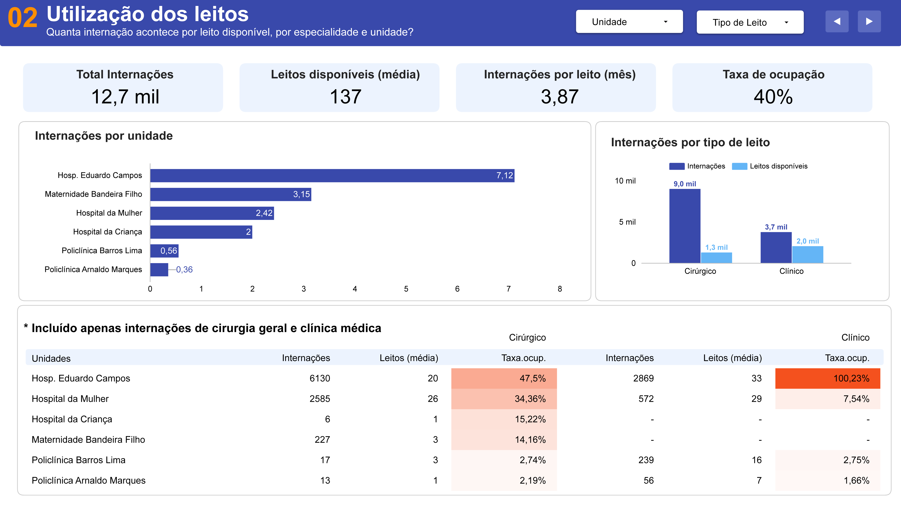
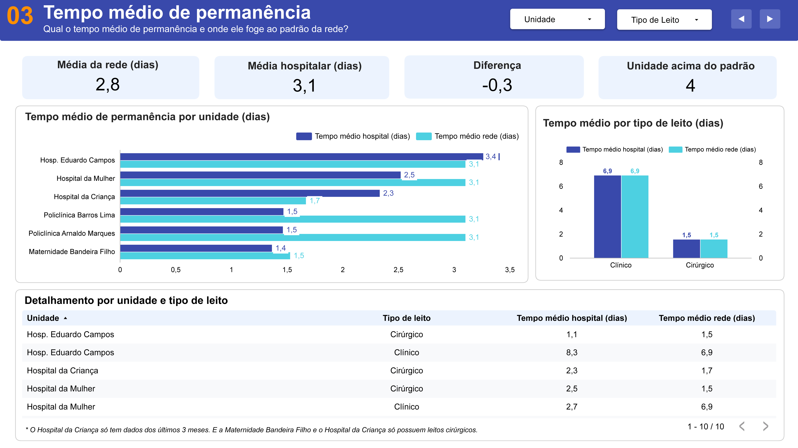
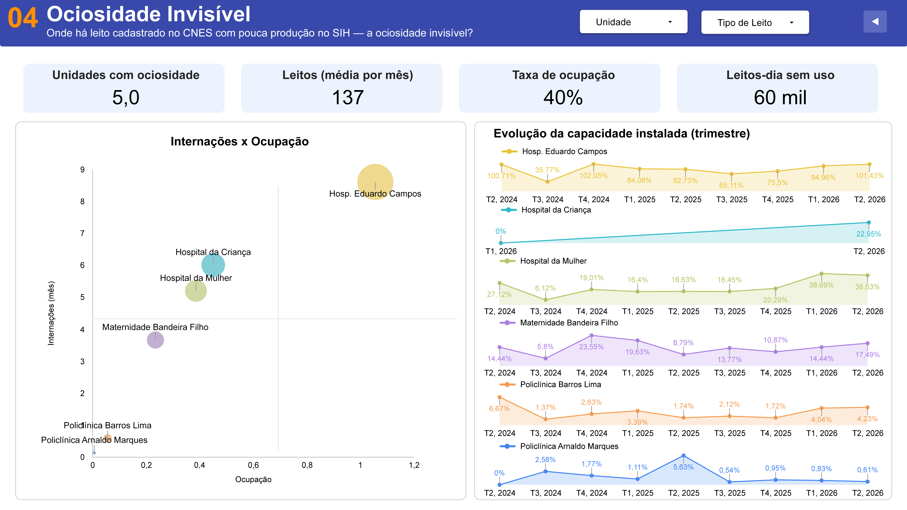

# Projeto P5 — Capacidade Hospitalar

## 1. Sobre o projeto

O Projeto P5 tem como objetivo analisar a **capacidade hospitalar e a utilização de leitos no município do Recife**, utilizando dados públicos de saúde disponibilizados pelo Ministério da Saúde.

O projeto integra dados de diferentes fontes públicas para construir uma base estruturada que permita analisar a oferta de leitos, as internações realizadas, o tempo de permanência dos pacientes e indicadores relacionados à utilização da capacidade hospitalar.

A solução é composta por um pipeline de dados, um banco de dados relacional, análises exploratórias, consultas analíticas e materiais para construção do dashboard e apresentação do projeto.

---

## 2. Equipe

**Integrantes:**

- Carlos Antônio Gadelha Araújo Júnior
- Deangellis Berg B da Silva
- Gabriela Melo Gonçalves Periera
- Gardênia Guedes Dias
- João Vitor Rodrigues Rochas
- Klebson Stefanini B Garcia
- Luciano Arruda Rodrigues da Silva
- Nathaly Maria Ferreira Novas
- Tais Maia Franca
- Vandelson Elias Monteiro Filho

**Mentor:**

- Lucas Gabriel

---

## 3. Tema

**Capacidade hospitalar no município do Recife.**

O projeto utiliza dados públicos para investigar a relação entre a capacidade instalada de leitos e sua utilização, considerando informações sobre estabelecimentos de saúde, leitos e internações.

---

## 4. Problema

A disponibilidade e a utilização adequada dos leitos hospitalares são aspectos importantes para o planejamento e a gestão dos serviços de saúde.

O projeto busca organizar e relacionar diferentes fontes públicas de dados para permitir uma análise estruturada da capacidade hospitalar do Recife, considerando:

- quantidade de leitos disponíveis;
- distribuição dos leitos por tipo e especialidade;
- quantidade de internações;
- tempo de permanência;
- utilização dos leitos;
- possíveis períodos ou situações de ociosidade;
- relação entre capacidade instalada e demanda observada.

A integração dessas informações permite construir uma base analítica para apoiar a investigação das perguntas definidas no projeto.

---

## 5. Objetivo

Construir um pipeline reprodutível para **coletar, transformar e carregar dados públicos de saúde**, disponibilizando uma base relacional que permita realizar análises sobre a capacidade hospitalar do município do Recife.

O projeto contempla as seguintes etapas:

1. coleta dos dados nas fontes públicas;
2. tratamento e padronização dos dados;
3. consolidação dos arquivos;
4. modelagem do banco de dados;
5. carga dos dados no PostgreSQL;
6. análise exploratória dos dados;
7. execução de consultas analíticas;
8. preparação das informações para o dashboard;
9. apresentação dos resultados.

---
## 6. Estrutura do projeto

```text
capacidade-hospitalar-next/
├── README.md                                      # documentação principal do projeto
├── requirements.txt                               # dependências do pipeline e das análises
├── .gitignore                                     # arquivos e diretórios não versionados
│
├── pipeline/
│   ├── 01_coleta.py                               # coleta CNES-LT, SIH-RD e MSHL; filtra Recife
│   ├── 02_transformacao.py                        # trata tipos, nulos e consolida os dados
│   ├── 03_carga.py                                # carrega os dados transformados no PostgreSQL
│   └── conexao.py                                 # gerencia a conexão com o PostgreSQL
│
├── sql/
│   └── 01_Schema/                                 
│       └── 01_schema.sql                          # DDL do banco: tabelas, PK/FK e domínios
│   └── 02_analises/                               # consultas SQL utilizadas nas análises
│       ├── 01_capacidade_instalada.sql            # consultas sobre capacidade de leitos
│       ├── 02_internacoes.sql                     # consultas sobre internações
│       ├── 03_tempo_permanencia.sql               # consultas sobre tempo de permanência
│       ├── 04_ociosidade.sql                      # consultas sobre utilização e ociosidade
│       └── 05_diagnostico.sql                     # consultas para geração dos indicadores
│   └── 03_views/                                  # views SQL utilizadas no dashboard
│       ├── vw_01_capacidade_instalada_2.sql       # view sobre capacidade de leitos
│       ├── vw_02_internacoes_2.sql                # view sobre internações
│       ├── vw_03_tempo_permanencia_2.sql          # view sobre tempo de permanência
│       ├── vw_04_ociosidade_2.sql                 # view sobre utilização e ociosidade
│       └── vw_05_diagnostico_2.sql                # view para geração dos indicadores
│
├── dados/
│   ├── amostra/                                   # amostra pequena para validação do projeto
│   └── brutos/                                    # dados completos; não versionados no Git
│       ├── AAAAMM/                                # dados CNES-LT e SIH-RD por competência
│       └── complementares/                        # dados MSHL, de frequência anual
│
├── analises/
│   ├── 00_qualidade_dados.ipynb                   # avaliação da qualidade e cobertura dos dados
│   ├── 01_eda_geral.ipynb                         # análise exploratória geral dos dados
│   ├── 02_eda_leitos.ipynb                        # análise exploratória dos leitos
│   ├── 03_eda_internacoes.ipynb                   # análise exploratória das internações
│   └── 04_eda_relacao_leitos_internacoes.ipynb    # relação entre leitos e internações
│
├── dashboard/
│   ├── prints/                                    # prints das páginas do dashboard
│   ├── esqueleto-painel.html                      # protótipo inicial do dashboard
│   └── ideia-de-visual-painel.md                  # proposta visual e organização do painel
│
├── pitch/
│   └── slides/                                    # slides utilizados na apresentação do projeto
│
└── docs/
    ├── de-para/                                   # mapeamentos e correspondências do projeto
    ├── fonte_dados/                               # dicionários, domínios e documentação das fontes
    ├── justificativa_mudanca_basedados/           # justificativas sobre fontes e banco de dados
    ├── ata-16-09-26.md                            # registro da reunião de 16/09/2026
    ├── ata-17-09-26.md                            # registro da reunião de 17/09/2026
    ├── ata-21-09-26.md                            # registro da reunião de 21/09/2026
    └── ata-22-09-26.md                            # registro da reunião de 22/09/2026
```

---

## 7. Como rodar a coleta do zero

### Pré-requisitos

- Python 3.13;
- PostgreSQL;
- `psql` disponível no terminal;
- acesso à internet para a etapa de coleta;
- acesso às fontes públicas utilizadas pelo projeto.

> Versões muito recentes do Python, como 3.14+, podem ainda não possuir suporte completo das bibliotecas utilizadas.

As dependências Python estão especificadas em `requirements.txt`.

---

## 8. Passo a passo

```bash
# 1. Clone o repositório
git clone https://github.com/Deangellisberg/capacidade-hospitalar-next.git
cd capacidade-hospitalar-next

# 2. Crie e ative o ambiente virtual (Python 3.13 especificamente)
py -3.13 -m venv .venv
source .venv/Scripts/activate      # Windows (Git Bash)
# source .venv/bin/activate        # macOS/Linux

# 3. Instale as dependências (versões fixadas — mesmas já testadas no projeto)
pip install -r requirements.txt

# 4. Rode a coleta e a transformação
python pipeline/01_coleta.py
python pipeline/02_transformacao.py
```

Isso coleta as três fontes de jan/2024 a dez/2026. Meses que ainda não aconteceram (ex.: os últimos meses de 2026, dependendo de quando você rodar) aparecem como "indisponível" no log — é esperado, não é erro. Rodar de novo não duplica nem refaz o que já foi coletado (a coleta é idempotente).

**Resultado esperado:** ao final, o log mostra um resumo com quantas competências deram certo, quantas foram puladas (já existiam), quantas ainda não estavam disponíveis na fonte e quantas falharam de verdade. Se "Erros" vier zero, a coleta está completa.

**Qual arquivo usar:** dentro de `dados/brutos/`, cada fonte gera dois arquivos — um com o dado bruto (Pernambuco inteiro, ou Brasil inteiro no caso do MSHL) e outro só com Recife. Use sempre o que termina em `_recife.parquet`; o outro existe só como auditoria.

---

## 9. Como criar o banco de dados

O projeto utiliza PostgreSQL como banco de dados relacional. O modelo foi desenvolvido considerando as relações entre estabelecimentos, leitos e internações.

O schema está disponível em `sql/01_Schema/01_schema.sql`.

### Pré-requisitos

- PostgreSQL instalado, com `psql` acessível no terminal. No Windows, se o `psql --version` der "command not found" mesmo com o PostgreSQL instalado, é um problema de PATH — adicione a pasta `bin` da instalação (ex.: `C:\Program Files\PostgreSQL\<versão>\bin`) ao PATH do sistema ou do Git Bash (`~/.bashrc`).

### Passo a passo

```bash
# 1. Crie o banco do projeto, já forçando UTF-8 explicitamente
psql -U postgres -c "CREATE DATABASE capacidade_hospitalar WITH ENCODING 'UTF8' LC_COLLATE='Portuguese_Brazil.1252' LC_CTYPE='Portuguese_Brazil.1252' TEMPLATE=template0;"

# Caso o ambiente não possua os locales indicados, use a versão simplificada:
psql -U postgres -c "CREATE DATABASE capacidade_hospitalar WITH ENCODING 'UTF8' TEMPLATE=template0;"

# 2. Rode o schema (cria as 9 tabelas, com PK/FK e os domínios já semeados)
psql -U postgres -d capacidade_hospitalar -f sql/01_Schema/01_schema.sql --set ON_ERROR_STOP=1

# 3. Confirme que as 9 tabelas foram criadas
psql -U postgres -d capacidade_hospitalar -c "\dt"
```

**Sobre o `WITH ENCODING 'UTF8' ... TEMPLATE=template0`:** sem isso, o banco pode herdar um encoding diferente de UTF-8 (dependendo da configuração regional do Windows), fazendo acento sair quebrado em qualquer consulta depois. `TEMPLATE=template0` garante que a criação não herda nada de um template padrão já "contaminado". Se der erro reclamando do `LC_COLLATE`/`LC_CTYPE` (alguns Windows não têm esse locale instalado), use a versão simplificada do comando.

**Se você já criou o banco sem esses parâmetros e está vendo acento quebrado:** confirme o encoding atual com `psql -U postgres -d capacidade_hospitalar -c "SHOW server_encoding;"`. O `server_encoding` só é definido na criação do banco — não tem como corrigir depois sem recriar. Apague o banco (`DROP DATABASE capacidade_hospitalar;`) e recrie com o comando acima.

**Sobre o `--set ON_ERROR_STOP=1`:** sem essa flag, o `psql -f` não para em erro — ele segue rodando o resto do script mesmo se uma linha falhar, mascarando o problema. Sempre use essa flag ao rodar scripts SQL neste projeto.

**Resultado esperado:** 9 tabelas (`lista_hospitais_gestao_propria`, `dim_estabelecimento`, `dom_tipo_leito`, `dom_codigo_leito`, `fato_leitos`, `dom_especialidade_sih`, `dom_tipo_aih`, `fato_internacoes`, `de_para_especialidade_leito`). As tabelas de domínio e o de-para de especialidade já vêm com dado (são referência fixa, não dependem de coleta); as demais ficam vazias até o `03_carga.py` popular com dado real.

## 10. Carga dos dados

```bash
# 1. Depois de criar o banco de dedos e executar o schema, execute:
python pipeline/03_carga.py

```

**A configuração da conexão utiliza as variáveis de ambiente definidas para o projeto**.

Consulte o arquivo ENV_COPY.txt como referência para as variáveis necessárias ao ambiente local.

## 11. Análises exploratórias (EDA)

Os notebooks ficam na pasta `analises/`:

- `00_qualidade_dados.ipynb`
- `01_eda_geral.ipynb`
- `02_eda_leitos.ipynb`
- `03_eda_internacoes.ipynb`
- `04_eda_relacao_leitos_internacoes.ipynb`

A organização por notebooks permite documentar as etapas de investigação, incluindo:

- o que foi analisado;
- por que determinada análise foi realizada;
- quais problemas ou padrões foram identificados;
- quais conclusões foram obtidas.

### Temas investigados

**Qualidade dos dados:** avaliação da consistência, cobertura, nulos, duplicidades e características das fontes utilizadas.

**Análise geral:** exploração inicial dos dados e identificação das principais características das bases.

**Leitos:** análise da capacidade instalada e distribuição dos leitos.

**Internações:** análise das internações, competências, especialidades e tempo de permanência.

**Relação entre leitos e internações:** investigação da relação entre a capacidade instalada e a utilização observada por meio das internações.

---

## 12. Consultas analíticas

As consultas ficam na pasta `sql/02_analises/`:

- `01_capacidade_instalada.sql`
- `02_internacoes.sql`
- `03_tempo_permanencia.sql`
- `04_ociosidade.sql`
- `05_diagnostico.sql`

As views ficam na pasta `sql/03_views/`:

- `vw_01_capacidade_instalada_2.sql`
- `vw_02_internacoes_2.sql`
- `vw_03_tempo_permanencia_2.sql`
- `vw_04_ociosidade_2.sql`
- `vw_05_diagnostico_2.sql`


## 13. Dashboard

[Link do painel](https://datastudio.google.com/s/sKtHR1N7BMw)

Prints das páginas

**Página 1: Capacidade instalada**:


**Página 2: Utilização dos leitos**:


**Página 3: Tempo médio de permanência**:


**Página 4: Ociosidade invisível**:


**Teste de reprodutibilidade**:

```bash
# Criar ambiente
py -3.13 -m venv .venv

# Ativar ambiente
source .venv/Scripts/activate

# Instalar dependências
pip install -r requirements.txt

# Coletar dados
python pipeline/01_coleta.py

# Transformar dados
python pipeline/02_transformacao.py

# Criar banco
psql -U postgres -c "CREATE DATABASE capacidade_hospitalar WITH ENCODING 'UTF8' TEMPLATE=template0;"

# Criar estrutura
psql -U postgres -d capacidade_hospitalar -f sql/01_schema.sql --set ON_ERROR_STOP=1

# Carregar dados
python pipeline/03_carga.py
```


## Fontes e dados coletados

| Fonte | O que traz | Frequência | Chave |
|---|---|---|---|
| **CNES-LT** | Quantidade de leitos por hospital e tipo (clínico, cirúrgico, etc.) | Mensal | `CNES` |
| **SIH-RD** | Internações: data de saída, dias de permanência, especialidade | Mensal | `CNES` |
| **MSHL** (Hospitais e Leitos/MS) | Nome do hospital, razão social, gestão, endereço | Anual | `CNES` |

| Campo (principais) | Fonte | Descrição |
|---|---|---|
| `CNES` | CNES-LT, SIH-RD, MSHL | Código do estabelecimento de saúde — chave de junção entre as três fontes, sem tabela-ponte |
| `CODUFMUN` | CNES-LT | Código do município (filtro: 261160 = Recife) |
| `TP_LEITO` | CNES-LT | Categoria do leito (1 = Cirúrgico, 2 = Clínico) |
| `CODLEITO` | CNES-LT | Especialidade específica do leito |
| `QT_EXIST` / `QT_SUS` | CNES-LT | Quantidade de leitos existentes / disponíveis ao SUS |
| `CGC_HOSP` | SIH-RD | CNPJ do hospital — mantido só como campo de auditoria, não é mais usado para join (as 16 unidades da Prefeitura não têm CNPJ próprio) |
| `DT_INTER` / `DT_SAIDA` | SIH-RD | Data de início e de saída do paciente |
| `DIAS_PERM` | SIH-RD | Dias de permanência internado |
| `ESPEC` | SIH-RD | Especialidade da internação |
| `IDENT` | SIH-RD | Tipo de AIH (1=Normal, 5=Longa permanência) — faz parte da chave primária de `fato_internacoes` |
| `NOME_ESTABELECIMENTO` | MSHL | Nome do hospital |
| `TP_GESTAO` | CNES-LT, MSHL | Esfera de gestão (M/E/D/S) |

Dicionário completo de todos os campos (incluindo os não usados diretamente pelas perguntas do Canvas, tipos de dado reais e tabelas de domínio) em `docs/fonte_dados/dicionario_campos_p5.docx`.

**Limitações conhecidas** (detalhadas em `docs/`):
- `fato_leitos` e `fato_internacoes` ligam com `dim_estabelecimento` por `cnes`, sem FK real (constraint) — o MSHL é publicado por ano e tem lacunas reais de cobertura. Sempre `LEFT JOIN` (nunca `INNER`), nunca descartando leito ou internação sem hospital correspondente.
- As competências mais recentes do SIH-RD chegam sistematicamente incompletas (defasagem estrutural do sistema).
